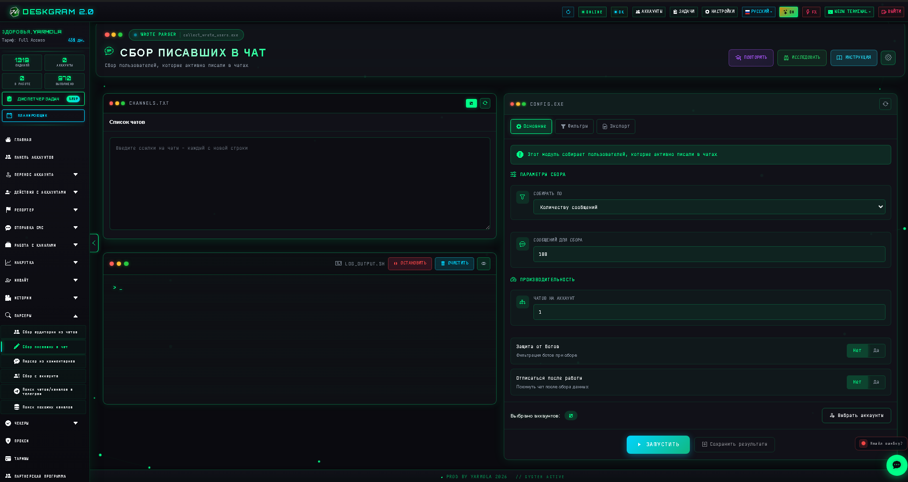
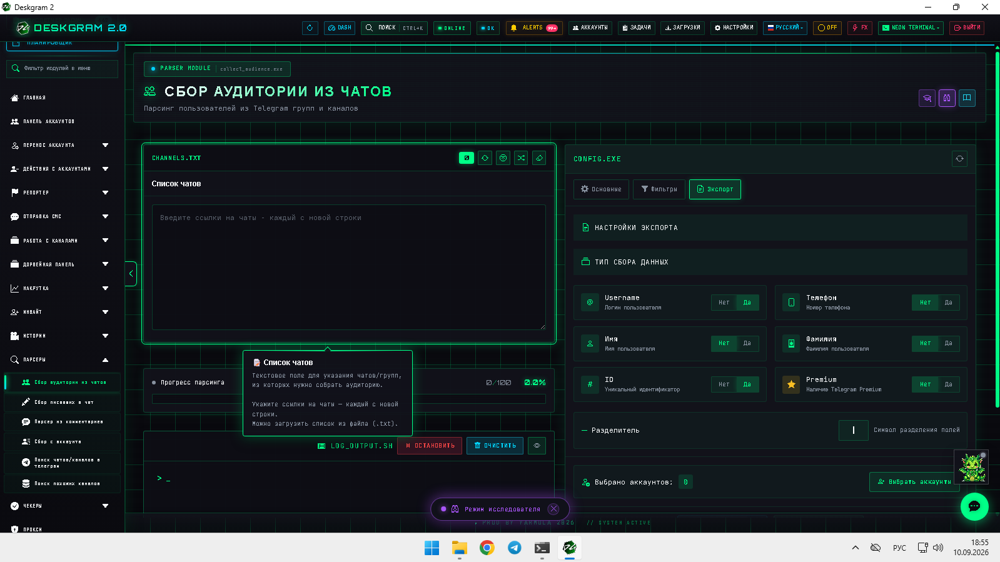
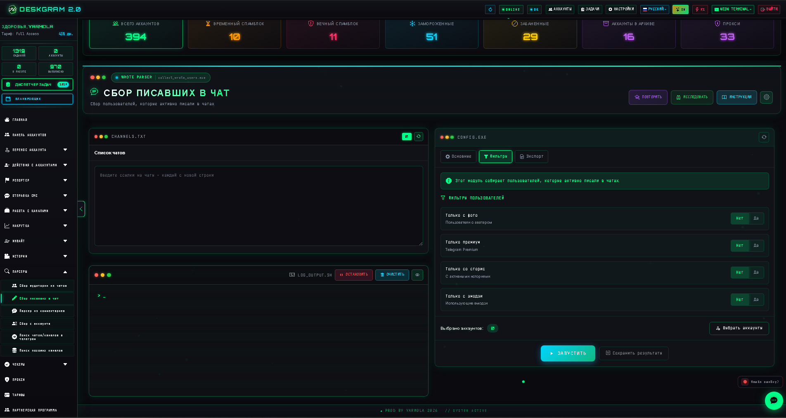

# Сбор писавших в чатах Telegram через Deskgram 2

Сбор писавших в чатах в Deskgram 2 нужен, когда важно получить аудиторию из живых обсуждений, а не только из подписчиков или общего поиска. Модуль помогает собирать пользователей, которые реально писали в чатах, и использовать эту базу дальше для анализа, сегментации и коммуникации.

[Главный хаб Deskgram 2](https://github.com/Deskgram-2/deskgram-2-telegram-automation) · [Сайт](https://deskgram2.com/) · [Telegram-бот](https://t.me/DG2welcomebot) · [Web preview](https://deskgram2.com/web-preview)
## Интерактивный Web Preview

Попробовать модуль в браузере: [Открыть веб-превью](https://deskgram2.com/web-preview?path=%2Fapp-demo%2Ffunctions%2Fcollect_whore_users)

## Скриншоты

## Кратко о модуле

| Параметр | Что внутри |
|---|---|
| Основная задача | Сбор пользователей, писавших в Telegram-чатах |
| Важные блоки | Список чатов, результаты, фильтры, статистика, логи |
| Полезен для | Поиска активной аудитории, анализа обсуждений, подготовки базы |
| Связанные модули | Сбор аудитории, Рассылка в ЛС, Инвайт |

## Что умеет модуль

- собирать пользователей из живых чатов Telegram;
- работать по списку выбранных чатов;
- фильтровать и структурировать результаты;
- показывать статистику и ход задачи;
- готовить базу для следующих сценариев воронки.

## Быстрый старт

1. Подготовьте список чатов, где есть живая активность.
2. Добавьте их в модуль.
3. Настройте параметры и фильтры сбора.
4. Запустите задачу и следите за логом.
5. Используйте результат в сборе, коммуникации или инвайте.

## Что обычно идет после такого сбора

- [Рассылка в ЛС](https://github.com/Deskgram-2/telegram-direct-messaging-deskgram), если активная база нужна для прямой коммуникации;
- [Нейрорассылка](https://github.com/Deskgram-2/telegram-neuro-mailing-deskgram), если дальше нужен AI-диалог с более теплой аудиторией;
- [Инвайт](https://github.com/Deskgram-2/telegram-invite-tool-deskgram), если активные участники ведут в рост групп и каналов;
- [Панель аккаунтов](https://github.com/Deskgram-2/telegram-account-manager-deskgram), если нужно заранее распределить рабочую сетку аккаунтов;
- [Диспетчер задач](https://github.com/Deskgram-2/telegram-task-manager-deskgram), если вы контролируете цепочку “сбор -> коммуникация -> рост” как единый поток.

## Как устроен сценарий

### Список чатов

На первом этапе задаются источники, из которых будет вестись сбор. Лучше всего работают чаты с понятной тематикой и устойчивой активностью.

### Фильтры и ограничения

Настройки помогают исключить лишний шум и сфокусироваться на более полезной части аудитории.

### Итоговая база

После выполнения сценария получается рабочий список пользователей, которые уже были активны в выбранных обсуждениях.

## Когда особенно полезен

- когда вы ищете не просто подписчиков, а реально активных участников обсуждений;
- когда нужно сегментировать аудиторию по чатам и тематикам;
- когда хотите строить дальнейшую коммуникацию на основе факта активности;
- когда важен discovery из живых сообществ.

## Почему это сильнее общего сбора

| Общий сбор | Сбор писавших в чатах в Deskgram 2 |
|---|---|
| Меньше сигналов вовлеченности | Есть признак реальной активности в чате |
| Сложнее понять контекст сообщества | Чаты дают более живую картину поведения |
| База может быть слишком широкой | Можно работать по точечным источникам |
| Хуже подходит под обсужденческие ниши | Лучше работает там, где важны живые разговоры |

## Что выбрать: сбор писавших в чатах или сбор из комментариев

| Если задача такая | Лучше использовать |
|---|---|
| Нужна база из активных участников чатов | [Сбор писавших в чатах](https://github.com/Deskgram-2/telegram-active-chat-users-parser-deskgram) |
| Нужна база из комментаторов под постами | [Сбор из комментариев](https://github.com/Deskgram-2/telegram-comment-audience-parser-deskgram) |
| Нужен discovery-маршрут по нескольким типам живой активности | Комбинировать оба модуля |
| Нужна база именно из обсужденческих ниш и живых сообществ | Сбор писавших в чатах |

## FAQ для рабочих сценариев

### Когда этот модуль сильнее обычного parser-а и comments-parser-а?

Когда важна активность именно в живых чатах, а не только под постами или в общем составе сообщества. Для обсужденческих ниш это часто самый сильный источник.

### Куда логичнее вести такую базу дальше?

Чаще всего в [рассылку в ЛС](https://github.com/Deskgram-2/telegram-direct-messaging-deskgram), [нейрорассылку](https://github.com/Deskgram-2/telegram-neuro-mailing-deskgram) или [инвайт](https://github.com/Deskgram-2/telegram-invite-tool-deskgram), в зависимости от того, нужен ли вам диалог, AI-слой или рост сообщества.

### Что сильнее всего влияет на результат?

Качество самих чатов, уровень реальной активности внутри них и то, насколько выстроен следующий шаг после сбора: коммуникация, сегментация или growth-сценарий.

## Смежные репозитории

- [Главный хаб Deskgram 2](https://github.com/Deskgram-2/deskgram-2-telegram-automation)
- [Сбор аудитории](https://github.com/Deskgram-2/telegram-audience-parser-deskgram)
- [Рассылка в ЛС](https://github.com/Deskgram-2/telegram-direct-messaging-deskgram)
- [Инвайт](https://github.com/Deskgram-2/telegram-invite-tool-deskgram)
- [Нейрорассылка](https://github.com/Deskgram-2/telegram-neuro-mailing-deskgram)
- [Панель аккаунтов](https://github.com/Deskgram-2/telegram-account-manager-deskgram)
- [Диспетчер задач](https://github.com/Deskgram-2/telegram-task-manager-deskgram)

## FAQ

### Для каких ниш это особенно полезно?

Для тех, где ключевая аудитория обсуждает тему в чатах и группах, а не просто читает каналы.

### Это другой тип базы, чем из комментариев?

Да. Здесь фокус именно на авторах сообщений в чатах, а не на комментаторах под постами.

### Можно ли потом использовать эту аудиторию в других модулях?

Да. Это хороший слой для дальнейшей сегментации, коммуникации и инвайта.
